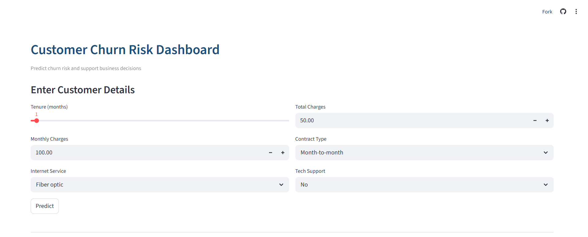
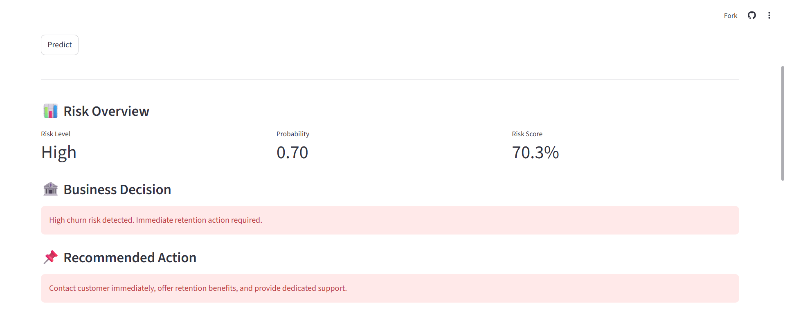
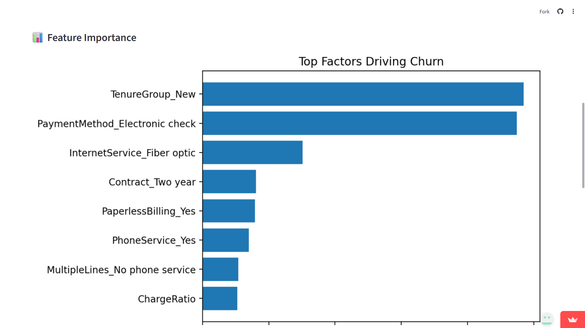
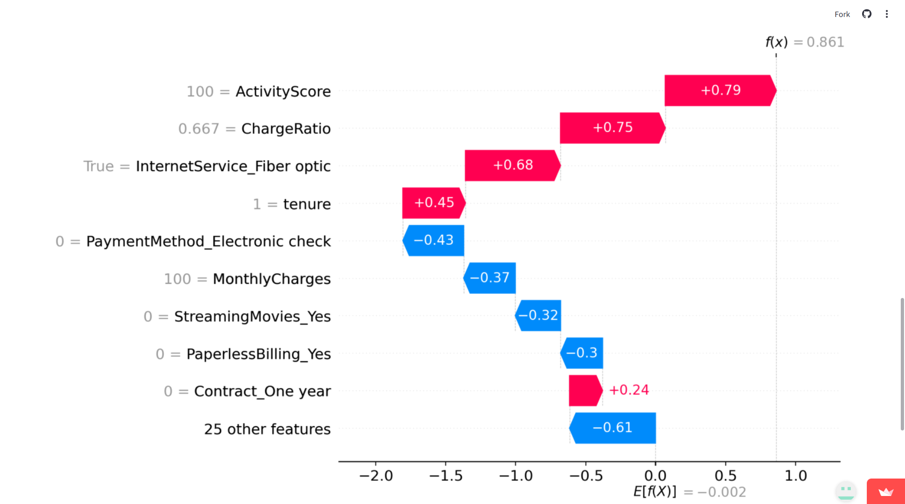
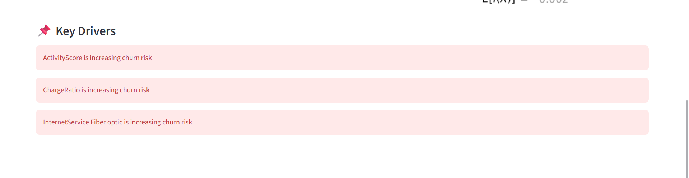

# 📊 Customer Churn Risk Intelligence Dashboard

A complete end-to-end machine learning system to **predict customer churn risk and explain the reasons behind it**, helping businesses take proactive retention actions.

---

## 🚀 Problem Statement

Customer churn is one of the biggest challenges for subscription-based businesses.

Most systems only predict churn —  
👉 but don’t explain *why it happens*

This project solves both:

✔ Predict churn risk  
✔ Explain key drivers  
✔ Suggest business actions  

---

## 🎯 Project Objective

- Identify customers likely to churn  
- Provide interpretable insights using SHAP  
- Enable data-driven retention strategies  

---

## 🧠 Solution Overview

This project combines:

- **XGBoost Model** → High-performance prediction  
- **Feature Engineering** → Behavior-based insights  
- **SHAP Explainability** → Transparent predictions  
- **Streamlit Dashboard** → Interactive UI  

---

## ⚙️ Machine Learning Pipeline

### 🔹 Data Processing

- Handled missing values  
- Encoded categorical variables  
- Feature alignment using saved columns  

### 🔹 Feature Engineering

- **ChargeRatio = MonthlyCharges / TotalCharges**  
- **ActivityScore = tenure × MonthlyCharges**  

These features capture:

- Customer engagement  
- Spending behavior  

---

## 📊 Model Performance

| Metric            | Value            |
|------------------|------------------|
| Model            | XGBoost          |
| ROC-AUC Score    | **0.82**         |
| Accuracy         | Strong           |
| Interpretability | High (via SHAP)  |

---

## 📸 Application Walkthrough

### 🔹 1. User Input Interface



Users provide:
- Tenure  
- Charges  
- Contract type  
- Services  

---

### 🔹 2. Risk Prediction Output



Example:

- Risk Level: **High**  
- Probability: **0.70**  
- Risk Score: **70.3%**

👉 Indicates strong likelihood of churn  

---

### 🔹 3. Business Decision Layer

- High → Immediate retention needed  
- Medium → Proactive engagement  
- Low → Stable customer  

This converts model output into **business action**

---

### 🔹 4. Feature Importance



Top drivers:

- Tenure (new customers at risk)  
- Payment method  
- Internet service type  

---

### 🔹 5. Explainable AI (SHAP)



SHAP shows:

- Which features increase churn  
- Which features reduce churn  

Example insights:

- ActivityScore → strongly increases risk  
- ChargeRatio → increases risk  
- MonthlyCharges → moderate effect  

👉 This removes black-box behavior  

---

### 🔹 6. Key Drivers Summary



Clear business interpretation:

- ActivityScore → increasing churn  
- ChargeRatio → increasing churn  
- Fiber optic service → increasing churn  

---

## 💡 Key Insights from Model

- New customers are highly prone to churn  
- High spending without long-term commitment increases risk  
- Contract type plays a major role  
- Engagement (ActivityScore) directly impacts retention  

---

## 📌 Business Recommendations

### High Risk Customers
- Immediate outreach  
- Personalized retention offers  
- Dedicated support  

### Medium Risk Customers
- Improve onboarding  
- Increase engagement  

### Low Risk Customers
- Loyalty programs  
- Maintain satisfaction  

---

## 🛠️ Tech Stack

- Python  
- Pandas, NumPy  
- XGBoost  
- SHAP  
- Matplotlib  
- Streamlit  

---

## ▶️ Run the Application

```bash
streamlit run app.py
```

---

## 🔗 Live Demo

👉 https://explainable-customer-churn-risk-dashboard-h8unhhkjcvpyjoib73me.streamlit.app/

---

## 🎯 What makes this project strong

This is not just a model.

It is a complete decision-support system:

* ✔ Prediction
* ✔ Explanation
* ✔ Business action

---

## 👨‍💻 Author

**M. Yeswanth Reddy**

---

## 🔥 Final Note

This project shows:

* End-to-end ML understanding
* Explainable AI usage
* Real business thinking

👉 This project demonstrates how machine learning can move beyond prediction and support real business decisions through explainable insights.

---

## 📌 Conclusion

This project highlights how machine learning can be used not only to predict outcomes but also to support real-world decision-making.

By combining:

* Prediction
* Explainability
* Business logic

👉 it provides a practical solution for reducing customer churn.
